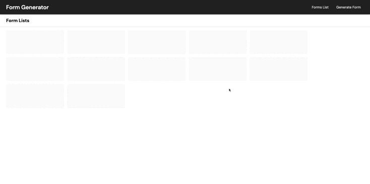
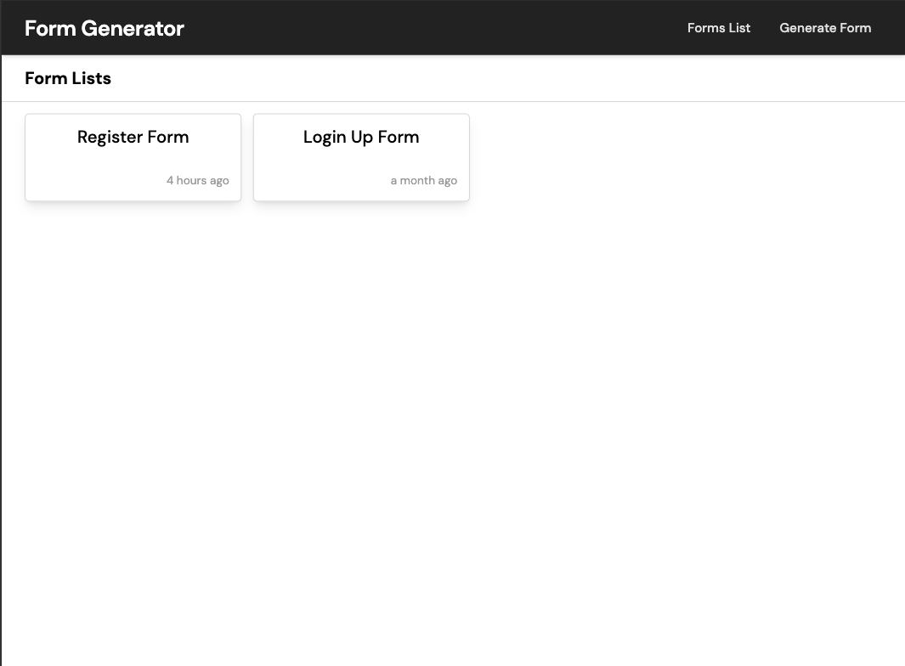
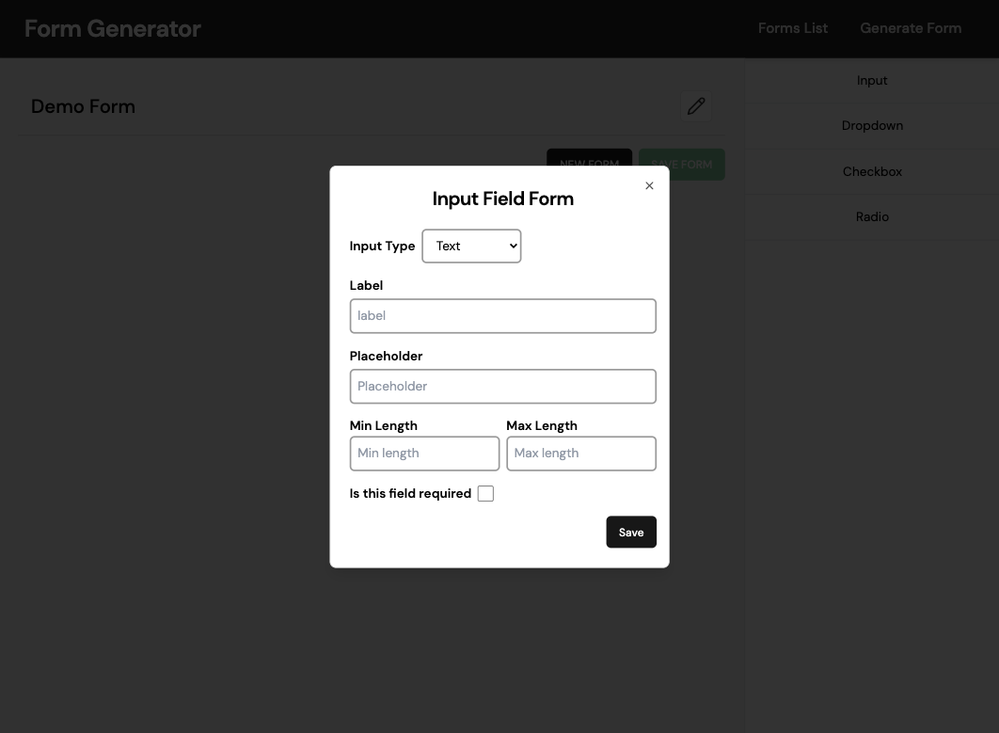
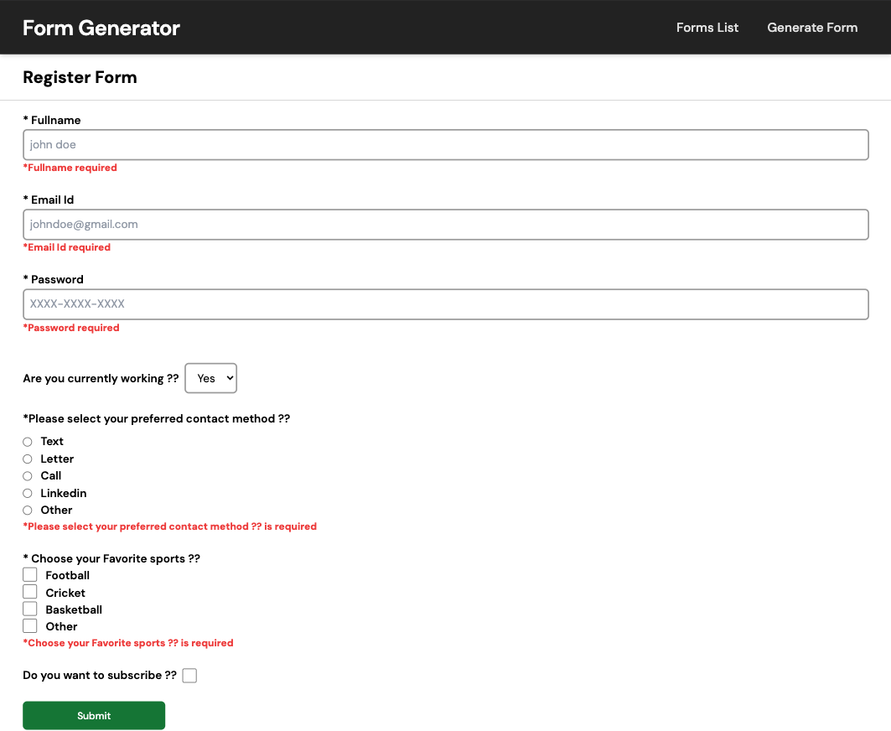
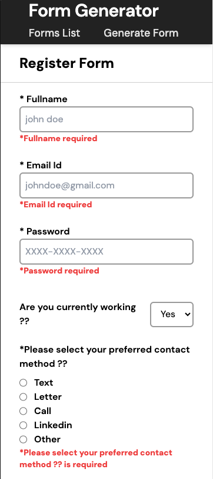
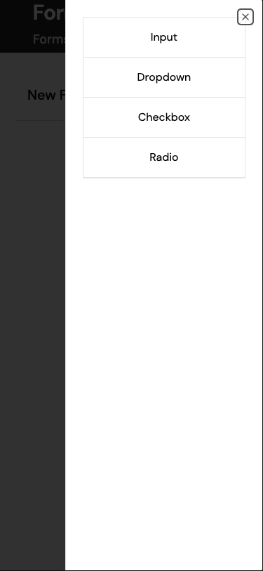

# Form Generator App

`Form Generator App` is designed to create dynamic forms using a graphical user interface (UI), and it allows users to add validation to the forms.

## Live App - [https://rahulkuvlekar-form-generator-app.netlify.app](https://rahulkuvlekar-form-generator-app.netlify.app)

## Demo



# Contents

- [Form Generator App](#form-generator-app)
  - [Live App - https://rahulkuvlekar-form-generator-app.netlify.app](#live-app---httpsrahulkuvlekar-form-generator-appnetlifyapp)
  - [Demo](#demo)
- [Contents](#contents)
  - [Why?](#why)
  - [Installation](#installation)
  - [Folder Structure](#folder-structure)
  - [Technologies \& Libraries used](#technologies--libraries-used)
  - [Features](#features)
  - [Screens](#screens)

### Why?

---

I wanted a app that helps user to build:

- Streamline form creation: Developed to simplify and expedite the process of creating dynamic forms, reducing manual effort and time.
- Enhance user experience: Aimed at providing users with an intuitive interface for building custom forms tailored to their specific requirements.
- Enable validation functionality: Incorporated validation features to ensure data accuracy and integrity, improving the overall quality of form submissions.
- Support flexibility and customization: Designed to offer users the ability to customize form elements and validation rules according to their unique needs, fostering adaptability.

`Form Generator App` checks all of those boxes.

### Installation

---

```bash
$ gh repo clone RahulKuvlekar/form-generator-app
$ cd form-generator-app
$ npm install
$ npm run dev
```

### Folder Structure

---

```shell
src/
│
├── components
│   ├── GenerateFormPage
│   │   └── ...
│   ├── Homepage
│   │   └── ...
│   ├── Layout
│   │   └── ...
│   ├── Navigation
│   │   └── ...
│   ├── ui
│   │   └── ...
│   └── ViewFormPage
│       └── ...
│
├── constants
│       └── index.js
├── context
│       └── FormContext.jsx
├── data
│       └── forms.json
├── hooks
│       └── useFormContext.js
├── reducers
│       └── FormReducer.js
├── App.css
│
├── App.jsx
│
├── index.css
│
└── main.jsx
```

### Technologies & Libraries used

---

- React
- Context API
- React Router
- Vanila Css
- TailwindCss
- ShadCn
- Moment.js

### Features

---

- Added Input Element with validation like input type, minimum length, maximum length & is required
- Added Dropdown Element with validation
- Added Checkbox Element with validation
- Added Radio Element with validation
- Mobile Responsiveness

### Screens

---

- ### Desktop Version
  </br></br>
  
  </br>
  
  </br>
  
  </br></br>
- ### Mobile Version
  </br></br>
   &nbsp; &nbsp; &nbsp; &nbsp; &nbsp; &nbsp; 
